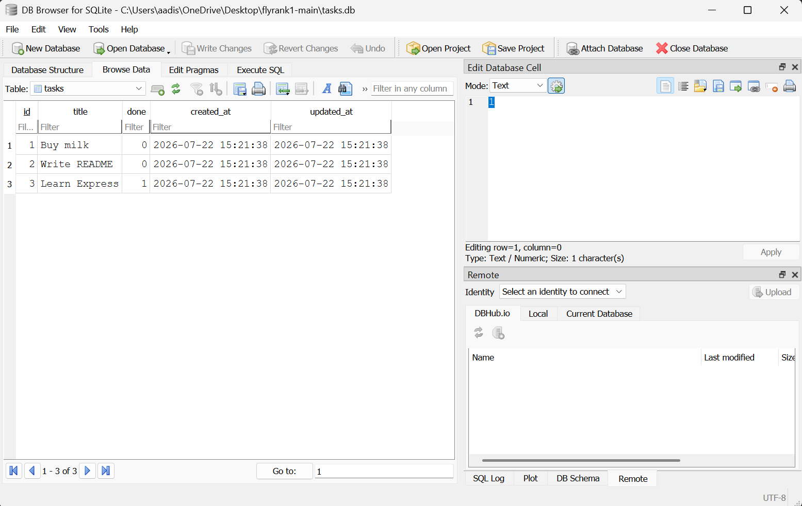

# Task API

A small in-memory CRUD API for managing a to-do list, built with **Node.js + Express**
for FlyRank Backend Track — Week 2, Assignment A1.

It supports the four CRUD operations on tasks (create, read, update, delete), is
documented and testable through **Swagger UI**, and keeps all data in memory
(no database — it resets whenever the server restarts, on purpose, see
"The mortality experiment" below).

## How to install & run

```bash
npm install
node server.js
```

The server starts on **http://localhost:3000**.
Open **http://localhost:3000/docs** in your browser for the interactive Swagger UI.

## Endpoints

| Method | Path          | Description                              | Success | Errors            |
|--------|---------------|-------------------------------------------|---------|--------------------|
| GET    | `/`           | API info (name, version, endpoints)       | 200     | —                  |
| GET    | `/health`     | Health check                              | 200     | —                  |
| GET    | `/tasks`      | List all tasks (supports filters below)   | 200     | —                  |
| GET    | `/tasks/:id`  | Get a single task                         | 200     | 404 not found      |
| POST   | `/tasks`      | Create a task (`{ "title": "..." }`)      | 201     | 400 invalid body   |
| PUT    | `/tasks/:id`  | Update a task's title and/or done         | 200     | 400 / 404          |
| DELETE | `/tasks/:id`  | Delete a task                             | 204     | 404 not found      |
| GET    | `/stats`      | `{ total, done, open }` counters          | 200     | —                  |
| POST   | `/reset`      | Reset to the 3 example tasks              | 200     | —                  |

### Query parameters on `GET /tasks` (stretch)

- `?done=true` / `?done=false` — filter by completion status
- `?search=milk` — only tasks whose title contains the word
- `?limit=2&offset=2` — pagination

Real APIs almost never return "everything" from a list endpoint — as a collection
grows to thousands of rows, an unbounded `GET /tasks` would mean huge, slow
responses and would make it easy to accidentally hammer the database. `limit`
and `offset` let a client ask for a manageable page at a time, and `search` /
`done` let the *server* do the filtering instead of shipping the whole table
to the client just to throw most of it away.

## Example: full CRUD cycle with curl

Create a task:

```
$ curl -i -X POST http://localhost:3000/tasks -H "Content-Type: application/json" -d '{"title":"Buy milk"}'
HTTP/1.1 201 Created
X-Powered-By: Express
Content-Type: application/json; charset=utf-8
Content-Length: 40
ETag: W/"28-PpSBYV7i68cXyGc7AhjVpkZkY5Q"
Date: Thu, 16 Jul 2026 11:46:10 GMT
Connection: keep-alive
Keep-Alive: timeout=5

{"id":4,"title":"Buy milk","done":false}
```

Read it back, mark it done, then delete it:

```
$ curl -s http://localhost:3000/tasks/4
{"id":4,"title":"Buy milk","done":false}

$ curl -s -X PUT http://localhost:3000/tasks/4 -H "Content-Type: application/json" -d '{"done":true}'
{"id":4,"title":"Buy milk","done":true}

$ curl -i -X DELETE http://localhost:3000/tasks/4
HTTP/1.1 204 No Content

$ curl -i http://localhost:3000/tasks/4
HTTP/1.1 404 Not Found
{"error":"Task 4 not found"}
```

## Swagger UI

> Run the server, open `http://localhost:3000/docs`, try the full CRUD cycle
## The mortality experiment

Create a few tasks, then restart the server (`Ctrl+C`, then `node server.js`
again) and call `GET /tasks`. You'll see only the original 3 seed tasks —
everything you added is gone, because it only ever lived in a JavaScript
array in RAM, not on disk. This is exactly why Week 3 introduces a real
database: anything worth keeping needs to be written somewhere that survives
the process exiting.

## Project structure

```
server.js       — the whole API (Express app, routes, in-memory data)
openapi.json    — OpenAPI 3.0 spec that Swagger UI reads to render /docs
package.json    — dependencies (express, swagger-ui-express, better-sqlite3)
tasks.db        — SQLite database file created automatically when the server runs
```

## Week 3 - Connecting CRUD to the database

### Why SQLite?
SQLite was chosen because it requires zero setup, runs entirely from a single file, and allows our data to survive server restarts. It's the simplest way to add persistence without needing a separate database server process. 

### Database File
The database file lives in `tasks.db`. It is created automatically the first time you run the server. It should be added to `.gitignore` so each clone of the project starts fresh.

### Running the Project
1. Run `npm install` to install dependencies (including `better-sqlite3`).
2. Run `node server.js` to start the server. The database file will be created and seeded automatically.

### DB Browser Screenshot


### Example SQL Query (Stage 4)
```sql
SELECT * FROM tasks WHERE done = 1;
```
This returns only the completed tasks.

### Persistence Proof (API Didn't Change)
The curl commands shown in the **Example: full CRUD cycle with curl** section above *still pass* perfectly without any modification, even though we completely swapped out the storage layer. 
Identical tests passing is the proof that storage is "just an implementation detail" — the API contract remains the same, but the backend is now durable.

### Stretch Goals Implemented
- **Index:** `CREATE INDEX IF NOT EXISTS idx_tasks_title ON tasks(title)` — An index on `title` speeds up search/filtering queries by preventing full table scans.
- **Transaction:** The seeding of the three initial tasks is wrapped in a `db.transaction()`. This ensures it's all-or-nothing: if one task fails to insert, none of them will be inserted, preventing partial or corrupt state.
- **Search, Filter, Sort, Stats:** Implemented using SQL (`LIKE`, `WHERE done = ?`, `ORDER BY title`, `COUNT(*)`).
- **Timestamps:** Added `created_at` and `updated_at` to the schema and update logic. Changing the table's shape felt like a manual schema evolution — this is exactly why migrations exist.

### AI vs Me (Stage 6)

**My Prompt to the AI:**
> "Please update an Express in-memory CRUD API to use SQLite with better-sqlite3. The table should be called 'tasks' with columns 'id' (integer primary key), 'title' (text), and 'done' (boolean as 0/1). Create the table if it's missing. Seed three tasks only when empty. Ensure the five endpoints (GET /tasks, GET /tasks/:id, POST /tasks, PUT /tasks/:id, DELETE /tasks/:id) keep identical behavior, including returning 400 for bad input and 404 for unknown ids. You must use parameterized queries for all operations."

**What it did better:**
The AI automatically mapped the SQLite `1` and `0` values back to JavaScript `true` and `false` booleans in a clean utility function, ensuring the API responses didn't accidentally leak SQLite's integer boolean representation to the clients.

**What it got wrong:**
It missed adding an index for searching/sorting, and it didn't use a transaction for the initial database seeding. It also didn't naturally add `created_at` or `updated_at` because I didn't specify it in the prompt.

**What my prompt forgot to specify:**
I forgot to ask it to support query parameters like `?search`, `?done`, `?limit`, and `?offset` in the `GET /tasks` endpoint. The AI silently ignored these and just implemented a basic `SELECT * FROM tasks`.
